# Ark Architecture Reference

> Canonical technical reference for the Ark codebase. Terse, factual, no tutorials.
> Last updated: 2026-05-08

## Table of Contents

1. [Overview](#1-overview)
2. [Deployment Modes](#2-deployment-modes)
3. [Core Components](#3-core-components)
4. [ArkD -- Universal Agent Daemon](#4-arkd----universal-agent-daemon)
5. [Conductor -- Merged Daemon](#5-conductor----merged-daemon)
6. [MCP Socket Pooling](#6-mcp-socket-pooling)
7. [Channels -- Agent Communication](#7-channels----agent-communication)
8. [Executors](#8-executors)
9. [Compute and Isolation](#9-compute-and-isolation)
10. [Transcript Parsers](#10-transcript-parsers)
11. [LLM Router + TensorZero](#11-llm-router--tensorzero)
12. [Multi-Tenancy Details](#12-multi-tenancy-details)
13. [Event Bus + SSE Bus](#13-event-bus--sse-bus)
14. [Ports Reference](#14-ports-reference)
15. [Data Locations](#15-data-locations)
16. [Schema and Migrations](#16-schema-and-migrations)
17. [Key Architectural Decisions](#17-key-architectural-decisions)

---

## 1. Overview

Ark is an autonomous agent ecosystem that orchestrates AI coding agents through DAG-based SDLC flows. It ships as a single codebase that runs in two deployment modes -- **local single-user** (SQLite, file-backed stores, no auth) and **hosted control plane** (Postgres, DB-backed stores, API keys, multi-tenant, multi-user) -- with identical code paths toggled by `app.mode` (a polymorphic capability descriptor built from `config.database.url`). Core features include a two-axis compute layer (5 compute kinds × 4 isolation kinds), 6 agent runtimes (`claude-code`, `claude-agent`, `claude-max`, `codex`, `gemini`, `goose`), polymorphic transcript parsers, an OpenAI-compatible LLM router with optional TensorZero backend, MCP socket pooling, bidirectional agent channels, and a universal HTTP daemon (arkd) that runs on every compute target.

### 1.1 System Architecture Diagram

```mermaid
graph TB
    %% ── Domain Concepts (top layer) ──
    subgraph domain["Domain Concepts -- managed by AppContext"]
        direction LR
        Flows["Flows<br/>(YAML definitions)"]:::domain
        Sessions:::domain
        CostTracking["Cost Tracking<br/>(PricingRegistry +<br/>UsageRecorder)"]:::domain
        ComputeTemplates["Compute Templates"]:::domain
        Models["Models<br/>(catalog, 3 layers)"]:::domain
        Workspaces["Workspaces<br/>(multi-repo)"]:::domain
        LLMRouter["LLM Router<br/>(:8430)"]:::domain
        SkillsTools["Skills (7 YAML) /<br/>Tools"]:::domain
    end

    %% ── Conductor (merged daemon) ──
    Conductor["Ark Conductor (:19400)<br/>WebSocket JSON-RPC + HTTP<br/>owns AppContext"]:::server

    %% ── User-facing surfaces ──
    subgraph surfaces["User Surfaces"]
        direction LR
        WebUI["Web UI<br/>(Vite + SSE)"]:::surface
        CLI["CLI<br/>(ark command)"]:::surface
        Desktop["Desktop<br/>(Electron / Tauri)"]:::surface
    end
    surfaces -- "WebSocket / stdio<br/>JSON-RPC 2.0" --> Conductor

    %% ── Internal services owned by AppContext ──
    subgraph appContext["AppContext (packages/core/app.ts)"]
        direction TB
        Lifecycle["Session Services<br/>(create / attach / dispatch /<br/>hooks / stage-advance)"]:::internal
        ComputeService:::internal
        Repos["Repositories<br/>(SQL CRUD)"]:::internal
        Stores["Resource Stores<br/>(Flow, Skill, Agent,<br/>Runtime, Model, Workspace)"]:::internal
        TranscriptParsers["Transcript Parsers<br/>(claude, claude-agent,<br/>codex, gemini)"]:::internal
    end
    Conductor --> appContext
    domain --> appContext

    %% ── Deployment modes ──
    subgraph localMode["User / Local Mode"]
        direction TB
        ArkExec["ark server daemon start<br/>(boots Conductor + ArkD<br/>in one process)"]:::local
        SQLite["SQLite (~/.ark/ark.db)<br/>WAL mode"]:::local
        YAMLFiles["YAML files (~/.ark/)<br/>three-tier resolution"]:::local
    end

    subgraph controlPlane["Control Plane / Hosted Mode"]
        direction TB
        MultiTenant["Multi-Tenant + Multi-User<br/>tenant-scoped DI children"]:::hosted
        PostgresRDS["Postgres / RDS<br/>(DATABASE_URL)"]:::hosted
        RedisSSE["Redis SSE Bus<br/>(REDIS_URL)"]:::hosted
        HelmChart["Helm Chart<br/>(.infra/helm/)"]:::hosted
        WorkerReg["Worker Registry +<br/>Session Scheduler"]:::hosted
    end

    localMode --> appContext
    controlPlane --> appContext

    %% ── Hierarchical components ──
    subgraph hierarchy["Component Hierarchy (three-tier resolution)"]
        direction LR
        BuiltIn["Built-in<br/>(shipped with Ark)"]:::hierarchy
        TenantComp["Tenant<br/>(per-team)"]:::hierarchy
        UserComp["User<br/>(personal)"]:::hierarchy
        BuiltIn --> TenantComp --> UserComp
    end
    hierarchy -. "skills, agents,<br/>flows, runtimes,<br/>models, MCPs" .-> Stores

    %% ── Compute target ──
    subgraph compute["Compute Target (Local / EC2 / K8s / Firecracker)"]
        direction TB
        ArkD["arkd (:19300)<br/>per-compute agent manager<br/>file ops, exec, metrics,<br/>channel bus"]:::arkd
        subgraph agentRuntime["Agent Runtimes (in tmux or in-process)"]
            direction LR
            ClaudeCode["claude-code"]:::agent
            ClaudeAgent["claude-agent<br/>(Agent SDK)"]:::agent
            Codex["codex"]:::agent
            Gemini["gemini"]:::agent
            Goose["goose"]:::agent
        end
        Channels["Channels (MCP)<br/>per-session, ephemeral ports"]:::arkd
        MCPPooling["MCP Pooling<br/>(shared across sessions)"]:::arkd
        ArkD --> agentRuntime
        ArkD --> Channels
        ArkD --> MCPPooling
    end
    Conductor <-- "ArkClient WS<br/>(worker register,<br/>hooks channel sub)" --> ArkD

    %% ── Executors (how agents launch) ──
    subgraph executors["Executors (how agents launch)"]
        direction TB
        EX_Claude["claude-code<br/>(stdio + hooks)"]:::provider
        EX_ClaudeAgent["claude-agent<br/>(in-process SDK)"]:::provider
        EX_CLI["cli-agent<br/>(codex, gemini)"]:::provider
        EX_Goose["goose<br/>(recipe dispatch)"]:::provider
        EX_Sub["subprocess<br/>(arbitrary cmd)"]:::provider
        EX_Plugin["plugin executors<br/>(~/.ark/plugins/)"]:::provider
    end

    %% ── Two-axis compute model ──
    subgraph computeAxes["Compute × Isolation (two-axis)"]
        direction TB
        subgraph cpKinds["Compute kinds (5)"]
            CK_Local["local"]:::provider
            CK_FC["firecracker"]:::provider
            CK_EC2["ec2"]:::provider
            CK_K8s["k8s"]:::provider
            CK_Kata["k8s-kata"]:::provider
        end
        subgraph isoKinds["Isolation kinds (4)"]
            IK_Direct["direct"]:::provider
            IK_Docker["docker"]:::provider
            IK_Compose["compose"]:::provider
            IK_DevC["devcontainer"]:::provider
        end
    end

    executors -. "launch agent<br/>on target" .-> ArkD
    computeAxes -. "(compute, isolation)<br/>composed at dispatch" .-> compute

    %% ── Router URL injection ──
    LLMRouter -. "ANTHROPIC_BASE_URL /<br/>OPENAI_BASE_URL injection<br/>(via local arkd)" .-> agentRuntime

    %% ── Styles ──
    classDef domain fill:#fef3c7,stroke:#d97706,color:#92400e
    classDef server fill:#ddd6fe,stroke:#7c3aed,color:#4c1d95,stroke-width:3px
    classDef surface fill:#e0e7ff,stroke:#4f46e5,color:#312e81
    classDef local fill:#f3e8ff,stroke:#7c3aed,color:#5b21b6
    classDef hosted fill:#fce7f3,stroke:#db2777,color:#9d174d
    classDef hierarchy fill:#ecfdf5,stroke:#059669,color:#065f46
    classDef arkd fill:#fff7ed,stroke:#ea580c,color:#9a3412
    classDef agent fill:#f0fdf4,stroke:#16a34a,color:#166534
    classDef provider fill:#f8fafc,stroke:#64748b,color:#334155
    classDef internal fill:#f0f9ff,stroke:#0284c7,color:#0c4a6e
```



**Key relationships:**

- **Ark Conductor (`:19400`)** is the single control-plane process. It owns `AppContext` and exposes both the WebSocket JSON-RPC entrypoint (Web/CLI/Desktop) and external HTTP routes (`/hooks/status`, `/hooks/github/merge`, `/v1/chat/completions`, `/v1/models`, `/mcp`, `/.well-known/oauth-protected-resource`, `/health`, and `/terminal/:sessionId` WS). The old separate "Ark Server" / "Conductor" split (ports 19400 + 19100) was merged into this one daemon; the legacy `19100` listener is gone.
- **ArkD (`:19300`)** runs on every compute target as a stateless proxy -- manages agent lifecycle (tmux or in-process), serves file ops, exec, metrics, and is the channel bus for agent-side hook/report traffic. ArkD dials the conductor at `:19400` over a persistent ArkClient WebSocket (worker register + heartbeat); the conductor subscribes to arkd's `hooks` channel to drain `channel-report` / `channel-relay` envelopes, which avoids requiring a reverse tunnel into the compute target.
- **Executors** define HOW agents launch (5 built-in: `claude-code`, `claude-agent`, `cli-agent`, `goose`, `subprocess`). **Compute and Isolation** define WHERE they run as a two-axis composition: 5 compute kinds × 4 isolation kinds.
- **Components** (skills, agents, flows, runtimes, models, workspaces) follow three-tier resolution: built-in -> tenant -> user.
- **LLM Router (`:8430`)** is reachable directly or through the conductor proxy at `:19400/v1/*`. Executors inject `ANTHROPIC_BASE_URL` / `OPENAI_BASE_URL` pointing at the local arkd, which forwards to the conductor, which forwards to the router.

### 1.2 Message Flow

```
User (Web/CLI/Desktop)
  │ WebSocket JSON-RPC
  ▼
┌─────────────────────────────────────────────────────────────┐
│  Ark Conductor (:19400)  -- owns AppContext                  │
│   • WS JSON-RPC for surfaces (session/*, compute/*, ...)     │
│   • HTTP /hooks/status, /hooks/github/merge                  │
│   • HTTP /v1/* (router proxy), /mcp, /health                 │
└─────────────────────────────────────────────────────────────┘
  ▲                                                       │
  │ ArkClient WS (worker/register, heartbeat,             │ HTTP /channel/deliver
  │ subscribes to /channel/hooks/subscribe)               │ (forward tunnel)
  │                                                       ▼
  └────── arkd (:19300) ─────────────────────────────▶ Channel (ephemeral port)
                ▲                                          │
                │ /channel/<sid>: agent->conductor         ▼
                │ envelopes (channel-report, channel-relay)  Agent (claude-code,
                └─────────────────────────────────────────── claude-agent, codex, ...)
```

Reports from the agent flow `agent -> ark-channel (in-proc MCP) -> arkd /channel/<sid> -> publish on hooks channel -> conductor's arkd-events-consumer`. Steering from the human flows `conductor -> arkd /channel/deliver -> channel listener (port 19200+hash) -> ark-channel -> agent`.

### 1.3 Port Map

| Port         | Component                 | Direction                               | Protocol                                                |
| ------------ | ------------------------- | --------------------------------------- | ------------------------------------------------------- |
| 19400        | Conductor (merged daemon) | Surfaces -> API; arkd -> conductor      | WebSocket JSON-RPC + HTTP (`/hooks/*`, `/v1/*`, `/mcp`) |
| 19300        | ArkD                      | Conductor / agents -> per-compute proxy | HTTP RPC + WS channels                                  |
| 19200 + hash | Channels                  | Conductor -> agent (per-session)        | HTTP POST                                               |
| 8430         | LLM Router                | Agents (via arkd) -> LLM providers      | OpenAI-compatible HTTP                                  |
| 8420         | Web UI / API (`make dev`) | Browser -> backend                      | HTTP + Vite HMR (`:5173`)                               |

The channel base port and range come from `packages/core/config/profiles.ts`: `channels: { basePort: 19200, range: 10000 }`. Tests use `allocatePort()` to randomise to avoid collisions.

---

## 2. Deployment Modes

Ark is deployed in two modes with the same binary and the same code paths. `AppContext` builds a polymorphic `AppMode` capability bundle from `config.database.url`; downstream code never branches on `mode.kind` directly -- it asks `app.mode.<capability>`.

### 2.1 Local single-user mode (default)

| Aspect        | Value                                                                                                                                                                                             |
| ------------- | ------------------------------------------------------------------------------------------------------------------------------------------------------------------------------------------------- |
| Runtime       | Bun (from source or `ark` symlink)                                                                                                                                                                |
| Database      | SQLite at `~/.ark/ark.db` (WAL mode, 5s busy timeout)                                                                                                                                             |
| Stores        | File-backed three-tier (builtin > global `~/.ark/` > project `.ark/`)                                                                                                                             |
| Auth          | None (single user, tenant = `"default"`)                                                                                                                                                          |
| Conductor     | Started in-process by `ark server daemon start` on port `19400` (one process owns AppContext + WS + HTTP). Short-lived CLI commands skip the daemon and talk to the DB directly via `AppContext`. |
| ArkD          | Started on-demand per compute operation                                                                                                                                                           |
| Channels      | Unix sockets + localhost HTTP                                                                                                                                                                     |
| SSE bus       | In-memory                                                                                                                                                                                         |
| Cost tracking | Session-level, local DB                                                                                                                                                                           |
| Config        | `~/.ark/config.yaml`                                                                                                                                                                              |

### 2.2 Hosted / control plane multi-tenant mode

| Aspect        | Value                                                                                                 |
| ------------- | ----------------------------------------------------------------------------------------------------- |
| Runtime       | Bun (containerized)                                                                                   |
| Database      | PostgreSQL via `DATABASE_URL`                                                                         |
| Stores        | `DbResourceStore` on `resource_definitions` table (tenant-scoped rows)                                |
| Auth          | API keys REQUIRED (`auth.enabled: true`), format `ark_<tenantId>_<secret>`                            |
| Conductor     | Always running as the merged daemon (`:19400`); listens for WS JSON-RPC + HTTP hooks/MCP/router proxy |
| ArkD          | Runs on every compute target in the worker pool                                                       |
| SSE bus       | Redis via `REDIS_URL` (multi-instance safe)                                                           |
| Cost tracking | Tenant + user + session, `usage_records` table                                                        |
| Scheduler     | `WorkerRegistry` + `SessionScheduler` (`hosted/`)                                                     |
| Deployment    | `docker-compose up -d` or `helm install .infra/helm/ark/`                                             |
| Config        | Env vars + per-tenant DB rows                                                                         |

### 2.3 Comparison at a glance

| Aspect          | Local                | Control plane                     |
| --------------- | -------------------- | --------------------------------- |
| DB              | SQLite               | Postgres                          |
| Stores          | Files                | DB (tenant-scoped)                |
| Auth            | None                 | API keys + roles                  |
| Users           | 1 (you)              | Many                              |
| Tenants         | 1 (`default`)        | Many                              |
| SSE             | In-memory            | Redis                             |
| Compute         | Local + Docker / EC2 | Full pool, scheduled              |
| Cost tracking   | Session-level        | Tenant + user + session           |
| Scheduler       | None                 | WorkerRegistry + SessionScheduler |
| Config location | `~/.ark/config.yaml` | env vars + per-tenant DB rows     |

### 2.4 Same code, two modes

The same codebase handles both modes through two mechanisms:

1. **`AppMode` capability swap.** `AppContext` builds one `AppMode` at boot from `config.database.url`. The mode bundle owns the `database`, `migrations`, `secrets`, and `tenantScope` capabilities; handlers and services depend on those capabilities, never on a `hosted` boolean.

2. **Tenant scoping via `forTenant(id)`.** `AppContext.forTenant(tenantId)` delegates to `app.mode.tenantScope.forTenant()`. In local mode this is a no-op (single tenant); in hosted mode it builds a child Awilix container scope that re-binds tenant-scoped repositories and stores. Re-entrant calls with the same tenant short-circuit.

```ts
// packages/core/app.ts
const app = new AppContext(loadConfig());
await app.boot();
const scoped = app.forTenant("acme-corp");
await scoped.sessions.list(); // WHERE tenant_id = 'acme-corp'
```

---

## 3. Core Components

### 3.1 AppContext (`packages/core/app.ts`)

The root of the dependency graph. An Awilix DI container that owns every singleton: repositories, services, stores, providers, parsers, observability. Created by CLI, server daemon, and hosted entry points; disposed on shutdown.

```ts
class AppContext {
  // Repositories (SQL CRUD)
  sessions: SessionRepository;
  computes: ComputeRepository;
  computeTemplates: ComputeTemplateRepository;
  events: EventRepository;
  messages: MessageRepository;
  todos: TodoRepository;
  artifacts: ArtifactRepository;
  flowStates: FlowStateRepository;
  ledger: LedgerRepository;

  // Services
  sessionService: SessionService; // lifecycle facade
  computeService: ComputeService;
  sessionHooks: SessionHooks; // hook + report state machine
  sessionLifecycle: SessionLifecycle;
  sessionAttach: SessionAttachService;
  dispatchService: DispatchService;
  stageAdvance: StageAdvanceService;

  // Resource stores (three-tier YAML resolution)
  flows: FlowStore;
  skills: SkillStore;
  agents: AgentStore;
  runtimes: RuntimeStore;
  models: ModelStore;
  workspaces: WorkspaceStore;

  // Persistence + blobs
  snapshotStore: SnapshotStore;
  blobStore: BlobStore;

  // Multi-tenancy / auth
  tenants: TenantManager;
  teams: TeamManager;
  users: UserManager;
  apiKeys: ApiKeyManager;
  tenantClaudeAuth: TenantClaudeAuthManager;

  // Cost + transcripts
  pricing: PricingRegistry;
  usageRecorder: UsageRecorder;
  transcriptParsers: TranscriptParserRegistry;

  // Mode + tenant scoping
  mode: AppMode; // database / migrations / secrets / tenantScope
  forTenant(tenantId: string): AppContext;
  // ... + eventBus, pluginRegistry, statusPollers, compute/isolation registries
  boot(): Promise<void>;
  shutdown(): Promise<void>;
  static forTestAsync(): Promise<AppContext>;
}
```

CLI commands construct it with `skipConductor: true` to skip the in-process arkd / router / status-poller launchers when only short-lived DB reads are needed. The merged conductor daemon and hosted entrypoints set `skipConductor: false` so the same AppContext also boots arkd, the router, and the conductor pollers.

### 3.2 DatabaseAdapter abstraction (`packages/core/database/`)

Interface that lets the same repositories work on SQLite or Postgres.

| File          | Purpose                                                    |
| ------------- | ---------------------------------------------------------- |
| `database.ts` | `DatabaseAdapter` interface + `SqlStatement` + `SqlResult` |
| `sqlite.ts`   | `BunSqliteAdapter` wrapping `bun:sqlite`                   |
| `postgres.ts` | `PostgresAdapter` wrapping `pg` pool                       |

All repositories and stores depend only on `DatabaseAdapter`, never on `bun:sqlite` or `pg` directly. A drizzle client is built alongside the adapter (`buildSqliteDrizzle` / `buildPostgresDrizzle`) so new code can opt into the typed query builder; the legacy hand-rolled SQL repositories continue to work in parallel.

### 3.3 Repositories (`packages/core/repositories/`)

SQL CRUD behind typed classes. Column whitelists prevent injection. All repositories expose `setTenant(id)` so `forTenant()` can scope them.

| Repository                   | Table                |
| ---------------------------- | -------------------- |
| `SessionRepository`          | `sessions`           |
| `ComputeRepository`          | `compute`            |
| `ComputeTemplateRepository`  | `compute_templates`  |
| `EventRepository`            | `events`             |
| `MessageRepository`          | `messages`           |
| `TodoRepository`             | `todos`              |
| `ArtifactRepository`         | `session_artifacts`  |
| `FlowStateRepository`        | `flow_state`         |
| `LedgerRepository`           | `ledger_entries`     |
| `MembershipRepository`       | `memberships`        |
| `TenantRepository`           | `tenants`            |
| `TeamRepository`             | `teams`              |
| `UserRepository`             | `users`              |
| `TenantClaudeAuthRepository` | `tenant_claude_auth` |

### 3.4 Services (`packages/core/services/`)

Business logic. The legacy monolithic `session-orchestration.ts` was split into focused service modules:

| Service module                                                                                                                                  | Responsibility                                                                   |
| ----------------------------------------------------------------------------------------------------------------------------------------------- | -------------------------------------------------------------------------------- |
| `services/session/{create,attach,cleanup,fork-clone,review,suspend,terminate}.ts`                                                               | Session lifecycle                                                                |
| `services/dispatch/{dispatch-core,dispatch-fanout,dispatch-foreach,dispatch-hosted,target-lifecycle,target-resolver,launch,post-launch,...}.ts` | Dispatch + fan-out + per-target lifecycle                                        |
| `services/session-hooks/`                                                                                                                       | Hook + report state machine (replaces the old `applyHookStatus` / `applyReport`) |
| `services/stage-advance/`                                                                                                                       | Flow stage advancement, transcript parsing, completion                           |
| `services/session-dispatch-listeners.ts`                                                                                                        | Dispatch event pump                                                              |
| `services/compute*.ts`                                                                                                                          | Compute provisioning, lifecycle, secrets reconciliation                          |

The lifecycle facade (`SessionService` / `services/session.ts`) delegates the hot paths to `DispatchService`, `SessionLifecycle`, `SessionHooks`, and `StageAdvance` resolved from the DI container.

**Critical rule:** every exported function in `services/` takes `app: AppContext` as its first argument. No `getApp()` calls, no module-level state. Enforced during the DI migration.

```ts
// correct
await app.dispatchService.dispatch(sessionId);
await fanOut(app, parentId, opts);

// banned
await dispatch(sessionId); // would require getApp() inside
```

### 3.5 Stores (`packages/core/stores/`)

Resource stores for declarative YAML definitions.

| Store            | Resource                  | File path (local mode)                                          |
| ---------------- | ------------------------- | --------------------------------------------------------------- |
| `FlowStore`      | Flow YAML                 | `flows/definitions/*.yaml` (built-in) + `<arkDir>/flows/*.yaml` |
| `SkillStore`     | Skill YAML                | `skills/*.yaml` (built-in) + `<arkDir>/skills/*.yaml`           |
| `AgentStore`     | Agent YAML                | `agents/*.yaml` + `<arkDir>/agents/*.yaml`                      |
| `RuntimeStore`   | Runtime YAML              | `runtimes/*.yaml` + `<arkDir>/runtimes/*.yaml`                  |
| `ModelStore`     | Model catalog YAML        | bundled + `<arkDir>/models/` + `<projectRoot>/.ark/models/`     |
| `WorkspaceStore` | Multi-repo workspace defs | DB-backed (`workspaces` + `workspace_repos` tables)             |

**Local mode:** file-backed three-tier resolution `builtin > ~/.ark/<kind>/ > .ark/<kind>/` for the YAML stores. `WorkspaceStore` is always DB-backed (it represents structured multi-repo definitions, not a flat YAML file).

**Hosted mode:** the YAML stores are replaced by `DbResourceStore` reading from the `resource_definitions` table (columns: `name`, `kind`, `tenant_id`, `content`, `version`). Same `list() / get() / save() / delete()` interface.

Skills are now YAML (e.g. `skills/code-review.yaml`), not markdown.

Access via `app.flows`, `app.skills`, `app.agents`, `app.runtimes`, `app.models`, `app.workspaces`.

### 3.6 PricingRegistry + UsageRecorder

Universal cost tracking.

- **`PricingRegistry`** (`packages/core/observability/pricing.ts`) -- 300+ models loaded from LiteLLM JSON. Per-token input/output rates.
- **`UsageRecorder`** (`packages/core/observability/usage-recorder.ts`) -- records `usage_records` rows with `cost_mode` column:
  - `api`: per-token cost from `PricingRegistry`
  - `subscription`: `cost_usd = 0`, tokens still recorded for rate limit tracking (e.g. Claude Max)
  - `free`: `cost_usd = 0`

Stage-advance / completion calls `usageRecorder.record()` after parsing transcripts at session completion.

### 3.7 TranscriptParserRegistry

Polymorphic parser per runtime. Parsers self-register at boot via the DI container. Stage-advance looks up the parser by the runtime's `billing.transcript_parser` field, locates the transcript file via `findForSession({ workdir, startTime })`, then calls `parse(transcriptPath)`. See [Section 10](#10-transcript-parsers) for the interface.

### 3.8 ComputePoolManager

Tenant-scoped compute pools. A tenant can define named pools that restrict which compute kinds and regions sessions can land on. Pool registration is driven by the compute / isolation registries on `AppContext`; enforcement runs in the scheduler (hosted mode).

### 3.9 TenantPolicyManager (`packages/core/auth/tenant-policy.ts`)

Per-tenant policy store. Fields:

```ts
interface TenantComputePolicy {
  tenantId: string;
  allowedProviders: string[];
  defaultProvider: string;
  maxConcurrentSessions: number;
  dailyCostCapUsd: number;
  routerRequired: boolean;
  autoIndexRequired: boolean;
  routerPolicy: "quality" | "balanced" | "cost";
  tensorzeroEnabled: boolean;
  pools: string[];
}
```

DI-registered as `tenantPolicyManager` (resolved from the container). Enforced at session start and dispatch time by `services/dispatch/guards.ts`. Blocks requests that violate the policy.

### 3.10 ApiKeyManager (`packages/core/auth/api-keys.ts`)

Used in hosted mode. Manages API keys in the `api_keys` table.

- Format: `ark_<tenantId>_<secret>`
- Methods: `create`, `validate`, `revoke`, `rotate`, `list`
- Roles: `admin`, `member`, `viewer`, `worker`
- Secret stored as SHA-256 hash

`auth/context.ts` resolves a `TenantContext` from a bearer token; the conductor's WS / HTTP handlers extract the token, materialize the context, and only then call `app.forTenant(ctx.tenantId)` for downstream operations.

---

## 4. ArkD -- Universal Agent Daemon

**This is a critical section.** ArkD is what makes Ark's compute layer uniform across local, container, VM, and cloud targets.

### 4.1 What it is

A stateless HTTP server that runs on every compute target on port 19300. Single binary (`packages/arkd/server/`) that exposes agent lifecycle, file ops, exec, metrics, and the agent-side channel bus over HTTP and WebSockets.

### 4.2 Why it exists

Without arkd, the conductor would need to SSH into every compute target for every operation -- slow, auth-fragile, and N different code paths (local shell vs docker exec vs EC2 SSH vs K8s exec). Instead:

- Every compute target runs one arkd instance.
- Conductor speaks HTTP and WebSocket to arkd, always.
- Local, docker, EC2, K8s, firecracker -- all look identical to the control plane.

### 4.3 What it runs

Routes live under `packages/arkd/server/routes/`. Top-level groups:

| Route file            | Purpose                                                                                                                           |
| --------------------- | --------------------------------------------------------------------------------------------------------------------------------- |
| `agent.ts`            | Launch / kill / status / send / capture for a session's agent (tmux or in-process)                                                |
| `attach.ts`           | Pane attach helpers (used by the conductor's terminal WS bridge)                                                                  |
| `channel.ts`          | `/channel/<sid>` agent->conductor envelopes (`channel-report`, `channel-relay`); `/channel/deliver` conductor->agent forward path |
| `channels.ts`         | Generic publish/subscribe primitive (the `hooks` channel is multiplexed here)                                                     |
| `exec.ts`             | Run a command with sandbox                                                                                                        |
| `file.ts`             | `read` / `write` / `list` / file ops                                                                                              |
| `metrics-snapshot.ts` | CPU, memory, disk, uptime                                                                                                         |
| `process.ts`          | Process lifecycle helpers                                                                                                         |
| `misc.ts`             | Health, version, port probe                                                                                                       |

The conductor talks to arkd over a persistent ArkClient WebSocket (worker register + heartbeat) AND issues per-operation HTTP calls. The `/codegraph/index` endpoint that the previous architecture doc described has been removed along with the rest of the knowledge graph subsystem.

### 4.4 How conductor talks to it

Conductor (`http://<conductor>:19400`) issues HTTP and WS calls to arkd at `http://<compute-ip>:19300`. The compute layer knows how to find the arkd URL for each target via `Compute.getArkdUrl()`:

- `local` -- `http://localhost:19300`
- `ec2` (with `direct` / `docker` / `compose` / `devcontainer` isolation) -- `http://<ec2-public-ip>:19300` (via SSM)
- `k8s` / `k8s-kata` -- `http://<pod-ip>:19300` (via kubectl port-forward)
- `firecracker` -- `http://<vm-ip>:19300`

### 4.5 Where it runs

| Compute target                                 | How arkd is deployed                             |
| ---------------------------------------------- | ------------------------------------------------ |
| Local machine                                  | `ark arkd` starts it as a user process           |
| Docker / compose / devcontainer (local or EC2) | Baked into the image, starts via CMD on boot     |
| EC2 (direct)                                   | Installed by cloud-init, runs as systemd service |
| K8s pod                                        | Sidecar container in the agent pod               |
| Firecracker VM                                 | Baked into the rootfs, starts on boot            |

### 4.6 Auth

When `ARK_ARKD_TOKEN` is set, arkd requires bearer token auth on every request. The conductor fetches the token from the compute record before making calls. In local mode, the token is typically unset.

### 4.7 Channel relay role

See [Section 7](#7-channels----agent-communication). ArkD is the hop between the in-process `ark-channel` MCP server (stdio, running inside the agent) and the conductor.

- **Outbound (agent -> conductor).** Agent reports flow `agent -> ark-channel -> arkd /channel/<sid> -> publishOnChannel("hooks")`. The conductor subscribes to the `hooks` channel via `/channel/hooks/subscribe` over the forward tunnel; its `arkd-events-consumer` drains envelopes and dispatches by `kind`. ArkD does NOT POST channel reports directly to the conductor anymore -- the publish/subscribe path replaces a previous SSH `-R` reverse tunnel that broke under SSM.
- **Inbound (conductor -> agent).** Steering messages flow `conductor -> arkd /channel/deliver -> channel listener (port 19200+hash) -> ark-channel -> agent` using the forward tunnel.

---

## 5. Conductor -- Merged Daemon

The merged Ark control-plane daemon. One process owns `AppContext`, the WebSocket JSON-RPC entrypoint, and the agent-facing HTTP routes. Lives in `packages/conductor/`.

- **Port:** `19400`. Configurable via `ARK_CONDUCTOR_PORT` (`packages/core/constants.ts`). The legacy `19100` HTTP listener is gone.
- **Started by:** `ark server daemon start` (local mode) and `hosted/server.ts` (hosted mode). There is no separate "conductor" process anymore.
- **NOT started by:** short-lived CLI commands. They construct `AppContext` with `skipConductor: true` and talk to the DB directly.

### 5.1 Routes

WebSocket JSON-RPC (everything modeled as `<prefix>/<verb>`, gated by role):

| Prefix                                                | Examples                                                                    |
| ----------------------------------------------------- | --------------------------------------------------------------------------- |
| `session/*`                                           | `session/start`, `session/attach`, `session/dispatch`, `session/list`, ...  |
| `compute/*`                                           | `compute/list`, `compute/create`, `compute/start`, ...                      |
| `worker/*`                                            | `worker/register`, `worker/heartbeat`, `worker/deregister` (arkd-only role) |
| `admin/*`                                             | `admin/apikey/create`, `admin/policy/set`, ... (admin role)                 |
| `secrets/*`, `tenant/*`, `tools/*`, `webhooks/*`, ... | See `packages/conductor/handlers/*.ts`                                      |

External HTTP routes (preserved for callers that don't speak the WS RPC):

| Route                                         | Purpose                                                                                |
| --------------------------------------------- | -------------------------------------------------------------------------------------- |
| `POST /hooks/status`                          | Claude Code hook status events (busy/idle/error/done) -- `packages/conductor/index.ts` |
| `POST /hooks/github/merge`                    | GitHub PR merge webhook                                                                |
| `POST /v1/chat/completions`, `GET /v1/models` | OpenAI-compatible LLM router proxy passthrough (mounted via `mounts/llm-proxy.ts`)     |
| `GET /.well-known/oauth-protected-resource`   | RFC 9728 OAuth metadata for MCP SDK clients                                            |
| `ANY /mcp`                                    | MCP Streamable-HTTP transport (tenant-scoped after credential resolution)              |
| `WS /terminal/:sessionId`                     | Tenant-gated tmux pane attach                                                          |
| `GET /health`                                 | Liveness                                                                               |

### 5.2 Delegation pattern

Conductor handlers receive the `AppContext` explicitly -- no `getApp()` calls. They resolve a `TenantContext` from the caller's credentials, scope the app via `app.forTenant(ctx.tenantId)`, and delegate to services (`app.dispatchService`, `app.sessionHooks`, `app.stageAdvance`, ...). Handler files live in `packages/conductor/handlers/` (per-prefix: `session.ts`, `compute.ts`, `worker.ts`, `admin.ts`, ...).

---

## 6. MCP Socket Pooling

**This is a critical section.** MCP socket pooling is what lets Ark run dozens of parallel sessions without exhausting memory.

### 6.1 Problem

Each Ark session can have multiple agents. Each agent loads multiple MCP servers (filesystem, context7, playwright, github, etc.). Without pooling:

```
5 sessions x 6 MCP servers = 30 MCP processes
Each MCP process: 100-300 MB
Total: 3-9 GB just for MCPs
```

### 6.2 Solution

Run **one** process per MCP server. Share it across all sessions via Unix domain sockets.

- Single MCP process listens on `/tmp/ark-mcp-<name>.sock`
- Each session's agent connects via a tiny proxy: `{"command": "ark", "args": ["mcp-proxy", "/tmp/ark-mcp-<name>.sock"]}`
- The proxy speaks the MCP stdio protocol to the agent and forwards to the socket
- ~85-90% memory reduction in practice

### 6.3 SocketProxy architecture

The `SocketProxy` class (`packages/core/mcp-pool.ts`) wraps one MCP process and accepts multiple concurrent stdio clients.

```
agent-1 stdio <-> mcp-proxy <-> unix socket <-> SocketProxy <-> MCP process
agent-2 stdio <-> mcp-proxy <-> unix socket <-^
agent-3 stdio <-> mcp-proxy <-> unix socket <-^
```

Responsibilities:

- Multiplex JSON-RPC requests from N clients to one MCP process
- Track request IDs and route responses back to the right client
- Health monitoring + auto-restart on MCP process crash
- Graceful shutdown on drain

### 6.4 Config toggles

Under `mcp_pool:` in `~/.ark/config.yaml`:

```yaml
mcp_pool:
  enabled: true
  autoStart: true # start pool at boot
  poolAll: true # pool every MCP server found in configs
  excludeMcps: # names to keep as per-session processes
    - ark-channel # channels are always per-session
    - flaky-mcp
```

### 6.5 CLI entry

```bash
ark mcp-proxy /tmp/ark-mcp-<name>.sock
```

This is the client side. It speaks MCP stdio on stdin/stdout and opens a Unix socket connection to the pooled process. The session's `.mcp.json` references this command instead of spawning the MCP server directly.

---

## 7. Channels -- Agent Communication

**This is a critical section.** Channels are how agents communicate with the control plane and with humans.

### 7.1 What channels are

Bidirectional communication between the agent and the rest of the system. Based on the **official Claude Code `claude/channel` protocol**. Implemented in the `ark-channel` MCP server (in-process, stdio) on the agent side and in `packages/core/services/channel/` on the conductor side.

### 7.2 Protocol

The `ark-channel` MCP server declares the `claude/channel` capability. Communication is bidirectional:

**Inbound (control plane -> agent):**

- Transport: `notifications/claude/channel` JSON-RPC notifications
- Agent sees them as `<channel source="ark" ...>` tags in context
- Used for human steering, sub-agent handoff messages, verify gate failures

**Outbound (agent -> control plane):**
Two MCP tools on `ark-channel`:

| Tool            | Purpose                                                         |
| --------------- | --------------------------------------------------------------- |
| `report`        | Agent reports progress, completion, error, or a question        |
| `send_to_agent` | Agent messages other agents (for handoff, fan-out coordination) |

### 7.3 Data flow

```
Agent (claude-code / claude-agent / codex / ...)
  |
  | stdio MCP
  v
ark-channel MCP server (in-process, stdio)
  |
  | HTTP POST /channel/<sid>
  v
arkd (:19300 on the compute target)
  |
  | publishOnChannel("hooks")  --> envelope queued
  v
Conductor (:19400) subscribes to /channel/hooks/subscribe
  |
  | arkd-events-consumer dispatches by `kind` (channel-report, channel-relay, hook-event, ...)
  v
SessionHooks / DispatchService / StageAdvance
  |
  v
Database + SSE bus (Web/Desktop get live updates)
```

Reverse path (human steering):

```
Human sends message in Web/Desktop
  |
  v
Conductor
  |
  | HTTP POST /channel/deliver to compute arkd (forward tunnel always works)
  v
arkd (:19300)
  |
  | HTTP POST to channel listener port (19200 + hash)
  v
ark-channel HTTP listener
  |
  | MCP notifications/claude/channel
  v
Agent sees <channel source="ark" ...> tags
```

### 7.4 Port allocation

Channel ports are derived deterministically from the session ID:

```
channel_port = 19200 + (parseInt(sessionId.replace("s-",""), 16) % 10000)
```

This avoids port allocator races and makes ports reproducible across restarts. The allocation logic lives in `packages/core/channel.ts` and the base + range come from `packages/core/config/profiles.ts` (`channels.basePort`, `channels.range`). Tests randomise via `allocatePort()`.

### 7.5 Why not direct conductor <-> agent?

Because agents run on potentially remote compute (EC2, K8s, firecracker) reached over SSM forward tunnels. Going through arkd gives one HTTP endpoint per compute target (port 19300), and the publish/subscribe `hooks` channel means the conductor never needs an inbound path into the compute target -- it pulls envelopes over the same forward tunnel it uses for everything else.

---

## 8. Executors

Polymorphic agent launchers. Each executor knows how to launch a specific kind of runtime.

### 8.1 Interface

```ts
// packages/core/executor.ts
interface Executor {
  launch(opts: LaunchOptions): Promise<LaunchResult>;
  kill(sessionId: string): Promise<void>;
  status(sessionId: string): Promise<AgentStatus>;
  send(sessionId: string, input: string): Promise<void>;
  capture(sessionId: string): Promise<string>;
}
```

### 8.2 Built-in executors

Defined in `packages/core/executors/index.ts` (`builtinExecutors`):

| Name           | Purpose                                                                                                                               |
| -------------- | ------------------------------------------------------------------------------------------------------------------------------------- |
| `claude-code`  | Launches Claude Code in tmux. Writes `.claude/settings.local.json` with HTTP hooks; sets up MCP `ark-channel` server and hooks config |
| `claude-agent` | In-process Claude Agent SDK runtime; hooks stream via arkd's channel bus instead of file-based handlers                               |
| `cli-agent`    | Runs any CLI tool (codex, gemini) in tmux with worktree isolation. Uses the runtime's `command` array                                 |
| `goose`        | Launches Goose with a Goose recipe                                                                                                    |
| `subprocess`   | Spawns any command as a child process. Good for linters, test runners, custom scripts                                                 |

### 8.3 Registration

Executors are loaded at boot from `builtinExecutors` plus any user-provided plugin executors at `<arkDir>/plugins/executors/*.js`. An agent's `runtime` field points to a runtime YAML, and that runtime's `type` (or executor reference) selects the executor.

```yaml
# runtimes/codex.yaml
name: codex
type: cli-agent # -> selects the cli-agent executor
command: ["codex", "--auto"]
```

### 8.4 Router env injection

`packages/core/executors/router-env.ts` builds environment variables for router URL injection. When the LLM router is enabled, executors inject:

```
ANTHROPIC_BASE_URL=http://localhost:19300
OPENAI_BASE_URL=http://localhost:19300/v1
```

Variables point at the local arkd, which forwards to the conductor, which forwards to the router. This works for both local and remote compute targets without baking provider hostnames into the agent's env.

---

## 9. Compute and Isolation

Dispatch is built on a **two-axis** model: `ComputeKind × IsolationKind`. The legacy single `provider` column was dropped in migration `015_drop_legacy_provider_columns`; the source of truth is now the `compute_kind` + `isolation_kind` pair on the `compute` row.

### 9.1 Dispatch layering

```
1. Agent              YAML spec: prompt, tools, model, runtime: <name>
                      e.g. agents/implementer.yaml

2. Agent Runtime      How the agent transcript is driven and parsed.
                      claude-code | claude-agent | claude-max | codex | gemini | goose
                      Each runtime has different launch semantics
                      (CLI args, env vars, hook formats, session-resume).
                      Code: packages/core/executors/<type>.ts
                      YAML: runtimes/<name>.yaml (referenced by agent.runtime)

3. ComputeTarget      Composition: { compute, isolation }. Thin dispatch
                      seam, not a real abstraction. Built from the
                      (compute_kind, isolation_kind) pair on the compute row.
                      Code: packages/core/compute/compute-target.ts

4a. Compute           Where the workspace lives. Provision / start / stop /
                      destroy / getArkdUrl / ensureReachable / resolveWorkdir /
                      prepareWorkspace / flushPlacement.
                      Kinds: local | firecracker | ec2 | k8s | k8s-kata
                      Code: packages/core/compute/{local,k8s,k8s-kata}.ts,
                            packages/core/compute/ec2/compute.ts,
                            packages/core/compute/firecracker/compute.ts

4b. Isolation         How the agent process is sandboxed inside that compute.
                      prepare / launchAgent / shutdown.
                      Kinds: direct | docker | compose | devcontainer
                      Code: packages/core/compute/isolation/{direct,docker,
                            compose,docker-compose,devcontainer,
                            devcontainer-resolve}.ts

5. arkd               HTTP daemon (:19300) on every compute target.
                      The conductor talks to arkd over HTTP + WS to drive every
                      step on the compute side. Not really a layer -- it's
                      the destination/transport.
                      Code: packages/arkd/
```

**Why "agent runtime" (layer 2) ≠ "isolation" (layer 4b).** Layer 2 names belong to the agent transcript driver -- `claude-code`, `claude-agent`, `codex`, etc. -- and are referenced from agent YAML as `runtime: <name>`. Layer 4b names the sandbox the agent process runs _inside_: a docker container, a devcontainer, the host directly. Both used to be called "runtime"; the layer-4b concept was renamed `Isolation` so the two no longer collide (migration `012_isolation_kind_rename`).

The `packages/compute` and `packages/workspace` packages were folded under `packages/core/compute/` and `packages/core/stores/workspace/`; there is no separate top-level compute/workspace package anymore.

### 9.2 Compute kinds

| ComputeKind   | How it provisions                             | Isolation supported                           |
| ------------- | --------------------------------------------- | --------------------------------------------- |
| `local`       | Host directory (worktree)                     | `direct`, `docker`, `compose`, `devcontainer` |
| `firecracker` | Local Firecracker microVM                     | the VM is the isolation; uses `direct` inside |
| `ec2`         | AWS EC2 instance reached over SSM             | `direct`, `docker`, `compose`, `devcontainer` |
| `k8s`         | K8s pod with arkd sidecar                     | `direct`, `docker` (DinD)                     |
| `k8s-kata`    | K8s with Kata Containers runtime (VM-per-pod) | `direct`                                      |

Cross-product is declared per-compute via `ComputeCapabilities.isolationModes` (`packages/core/compute/types.ts`). Source of truth for "what can run where" is the `Compute` impl, not a static matrix.

### 9.3 Isolation kinds

| IsolationKind  | How the agent process is sandboxed                               |
| -------------- | ---------------------------------------------------------------- |
| `direct`       | Process spawned directly on the host (or VM) by arkd             |
| `docker`       | Process inside a docker container managed by arkd                |
| `compose`      | Multi-container compose project; agent runs in the named service |
| `devcontainer` | VS Code devcontainer spec resolved + built via `devcontainer up` |

### 9.4 Per-dispatch lifecycle (`runTargetLifecycle`)

Six structured `provisioning_step` events fire in order; each step is optional and skipped when the impl omits the method. Code: `packages/core/services/dispatch/target-lifecycle.ts`.

| #   | Step                | Owner     | What                                                              |
| --- | ------------------- | --------- | ----------------------------------------------------------------- |
| 1   | `compute-start`     | Compute   | If status=stopped, `Compute.start`. 1 retry / 2s backoff          |
| 2   | `ensure-reachable`  | Compute   | SSM / kubectl port-forward + arkd `/health`. Idempotent, no retry |
| 3   | `flush-secrets`     | Compute   | Replay deferred typed-secret placement. 1 retry / 1s              |
| 4   | `prepare-workspace` | Compute   | `mkdir` + `git clone` via arkd. 2 retries / 1s                    |
| 5   | `isolation-prepare` | Isolation | Bring up compose / build devcontainer / boot microVM. 1 retry     |
| 6   | `launch-agent`      | Isolation | arkd-side process spawn. No retry (tmux dedupe)                   |

Failures throw `ProvisionStepError(step, cause)` so the dispatch failure message names the failing phase. Each event carries `{ compute, computeKind }` plus step-specific context.

---

## 10. Transcript Parsers

Polymorphic, DI-based. Each runtime has its own parser that knows where its transcripts live on disk and how to extract token counts.

### 10.1 Interface

```ts
// packages/core/runtimes/transcript-parser.ts
interface TranscriptParser {
  readonly kind: string; // matches runtime.billing.transcript_parser
  parse(transcriptPath: string): ParseResult; // extract tokens from a path. Never throws.
  findForSession(opts: FindOpts): string | null; // locate the transcript file for a session
}

interface ParseResult {
  usage: TokenUsage;
  model?: string;
  transcript_path?: string;
}

interface FindOpts {
  workdir: string; // cwd the tool ran in -- disambiguates concurrent sessions
  startTime?: Date; // only consider transcripts created at or after this time
}
```

Session identification is the parser's `findForSession` responsibility (matches by exact workdir + start time, not "latest by mtime"); parsing operates on a path. This avoids the parallel-dispatch races that the old `parse(sessionId, workdir)` shape could trip over.

### 10.2 Implementations

| Runtime        | Implementation                                  | Transcript location                               | Identification       |
| -------------- | ----------------------------------------------- | ------------------------------------------------- | -------------------- |
| `claude`       | `packages/core/runtimes/claude/parser.ts`       | `~/.claude/projects/<slug>/<session>.jsonl`       | Workdir-derived slug |
| `claude-agent` | `packages/core/runtimes/claude-agent/parser.ts` | Captured by the in-process SDK + arkd channel bus | Session ID           |
| `codex`        | `packages/core/runtimes/codex/parser.ts`        | `~/.codex/sessions/YYYY/MM/DD/rollout-*.jsonl`    | Cwd-matched          |
| `gemini`       | `packages/core/runtimes/gemini/parser.ts`       | `~/.gemini/tmp/<slug>/chats/session-*.jsonl`      | projectHash-matched  |

### 10.3 Registry

`TranscriptParserRegistry` is exposed via `app.transcriptParsers`. Parsers are registered at boot inside the Awilix container (DI seed, not direct calls in `app.ts`); `register(parser)` keys them by `parser.kind`.

```ts
const parser = app.transcriptParsers.get(runtime.billing.transcript_parser);
const transcriptPath = parser?.findForSession({ workdir: session.workdir, startTime: session.created_at });
const parsed = transcriptPath ? parser!.parse(transcriptPath) : null;
```

### 10.4 Usage recording

Stage-advance feeds parsed tokens into `UsageRecorder`:

```ts
await app.usageRecorder.record({
  sessionId,
  tenantId,
  userId,
  model: parsed.model,
  tokens: parsed.usage,
  costMode: runtime.billing.cost_mode, // api | subscription | free
});
```

---

## 11. LLM Router + TensorZero

### 11.1 Router (`packages/router/`)

OpenAI-compatible HTTP proxy. Routes requests across multiple LLM providers with fallback and cost tracking.

- **Endpoint:** `POST /v1/chat/completions`, `GET /v1/models` (OpenAI-compatible)
- **Default port:** 8430
- **Reachable via:** direct calls to `:8430`, OR through the conductor's mounted proxy at `:19400/v1/*` (`packages/conductor/mounts/llm-proxy.ts`). Surfaces and remote agents (via arkd) typically hit the conductor mount so routing is consistent.
- **Start:** `ark router start [--port 8430] [--policy balanced]`

**Routing policies:**

| Policy     | Behavior                                 |
| ---------- | ---------------------------------------- |
| `quality`  | Prefer the best model regardless of cost |
| `balanced` | Optimize cost/quality tradeoff           |
| `cost`     | Minimize cost                            |

**Features:**

- Circuit breakers per provider with automatic fallback
- Request classification -- classifies prompt complexity to select appropriate model tier
- Cascade mode -- try cheap model first, escalate on low confidence
- Per-request cost accumulation with model/provider breakdown
- `onUsage` callback that wires into `UsageRecorder`

### 11.2 TensorZero integration (`packages/core/router/tensorzero.ts`)

Optional Rust-based gateway (Apache 2.0) that replaces the Bun router for production. Higher throughput and lower latency.

**Lifecycle manager start order:**

1. Sidecar mode -- detect existing instance (control plane / docker-compose)
2. Native binary -- vendored binary at `bin/tensorzero-gateway` next to ark
3. Docker fallback -- Docker container (only if native binary not found)

Config generated from configured API keys into `tensorzero.toml` under `app.config.dirs.ark` (the older `$HOME` / `/tmp` fallback was removed; callers must supply an ark-controlled `configDir`). Auto-starts on boot when `router.autoStart && tensorZero.enabled`.

**Default port:** 3000

### 11.3 Router URL injection

When the router (Bun or TensorZero) is enabled, executors inject base URLs into agent env via `executors/router-env.ts`:

```
ANTHROPIC_BASE_URL=http://localhost:19300
OPENAI_BASE_URL=http://localhost:19300/v1
```

The agent calls the local arkd; arkd forwards to the conductor's `/v1/*` mount; the conductor proxies to the router; the router fans out to real providers and calls `onUsage` with the token counts. `UsageRecorder` writes a `usage_records` row with the tenant and session ID.

### 11.4 Cost modes

The router writes costs with the runtime's `cost_mode`:

| Mode           | Behavior                                                                   |
| -------------- | -------------------------------------------------------------------------- |
| `api`          | Look up per-token rate in `PricingRegistry` (300+ models via LiteLLM JSON) |
| `subscription` | `cost_usd = 0`, but tokens still recorded for rate limit tracking          |
| `free`         | `cost_usd = 0`                                                             |

---

## 12. Multi-Tenancy Details

### 12.1 Tenant scoping on every entity

Every tenant-relevant table has a `tenant_id` column:

```
sessions, compute, compute_templates, events, messages, todos,
groups, schedules, usage_records, resource_definitions,
api_keys, tenants, users, teams, memberships,
session_artifacts, flow_state, ledger_entries, stage_operations,
tenant_policies, tenant_claude_auth, workspaces, workspace_repos
```

Sessions additionally have a `user_id` column that tracks which user inside the tenant owns the session.

### 12.2 `AppContext.forTenant(id)`

Creates a tenant-scoped view of the context. Delegates to `app.mode.tenantScope.forTenant(this, id)`:

- Local mode -- single-tenant; returns self (no isolation to enforce).
- Hosted mode -- builds a child Awilix container scope. Re-entrant calls with the same tenant short-circuit. Tenant-scoped repositories and stores are re-bound inside the child scope.

```ts
const scoped = app.forTenant("acme-corp");
await scoped.sessions.list(); // WHERE tenant_id = 'acme-corp'
await scoped.flows.list(); // DB-backed flows filtered to acme-corp
```

### 12.3 TenantPolicyManager

Enforced at session start and dispatch time by the dispatch guards. Fields include:

| Field                   | Purpose                                                |
| ----------------------- | ------------------------------------------------------ |
| `allowedProviders`      | Whitelist of compute kinds (or legacy provider labels) |
| `defaultProvider`       | Fallback if request doesn't specify                    |
| `maxConcurrentSessions` | Hard cap                                               |
| `dailyCostCapUsd`       | Enforced via `UsageRecorder` totals                    |
| `routerRequired`        | Force LLM router usage (reject direct provider calls)  |
| `autoIndexRequired`     | Force auto-index on dispatch                           |
| `routerPolicy`          | Override agent's router policy                         |
| `tensorzeroEnabled`     | Force TensorZero backend                               |
| `pools`                 | Restrict to specific compute pools                     |

### 12.4 DbResourceStore for hosted mode

In hosted mode, file-backed YAML stores are replaced with `DbResourceStore` on the `resource_definitions` table.

```sql
CREATE TABLE resource_definitions (
  id         TEXT PRIMARY KEY,
  tenant_id  TEXT NOT NULL,
  kind       TEXT NOT NULL,  -- agent | flow | skill | runtime (model + workspace use dedicated stores)
  name       TEXT NOT NULL,
  content    TEXT NOT NULL,  -- YAML
  version    INTEGER NOT NULL,
  created_at TIMESTAMPTZ NOT NULL,
  updated_at TIMESTAMPTZ NOT NULL,
  UNIQUE (tenant_id, kind, name)
);
```

Same `list() / get() / save() / delete()` interface as file-backed stores. Each tenant has their own copy of any resource they've customized.

### 12.5 Export/import for portability

`ark resource export` and `ark resource import` move YAML between file-backed (local) and DB-backed (hosted) stores. Users can author resources locally and push them to a hosted tenant, or pull a hosted tenant's resources into a local workspace.

---

## 13. Event Bus + SSE Bus

### 13.1 In-memory event bus

Pub/sub for in-process listeners. Used by:

- Session services to emit lifecycle events (`dispatched`, `stage_advanced`, `completed`, etc.)
- Metrics polling to emit sample events
- Conductor to fan out events over SSE/WebSocket to UI clients

All listeners are in-process; the event bus does not cross process boundaries.

### 13.2 SSE bus

Server-Sent Events bus for UI live updates (Web, Desktop). The canonical SSE endpoint is `GET /api/events/stream` (consumed by the web frontend at `packages/web/src/hooks/useSessions.ts`).

| Mode                    | Implementation | File                                |
| ----------------------- | -------------- | ----------------------------------- |
| Local / single instance | In-memory      | `packages/core/hosted/sse-bus.ts`   |
| Hosted / multi-instance | Redis-backed   | `packages/core/hosted/sse-redis.ts` |

The Redis backend uses Redis pub/sub so that events produced on one control plane instance reach SSE clients connected to a different instance. Enabled when `REDIS_URL` is set (`hosted/server.ts` constructs the `RedisSSEBus`).

Clients subscribe to `/api/events/stream` and get a stream of JSON events for the tenant's sessions.

---

## 14. Ports Reference

| Service                   | Default port                     | Configurable via     | Notes                                                                                                                      |
| ------------------------- | -------------------------------- | -------------------- | -------------------------------------------------------------------------------------------------------------------------- |
| Conductor (merged daemon) | `19400`                          | `ARK_CONDUCTOR_PORT` | WebSocket JSON-RPC + HTTP `/hooks/*`, `/v1/*`, `/mcp`, `/terminal/:id`, `/.well-known/oauth-protected-resource`, `/health` |
| ArkD                      | `19300`                          | `ARK_ARKD_PORT`      | Universal agent daemon, one per compute target                                                                             |
| Channel                   | `19200 + hash`                   | derived              | `19200 + (parseInt(sessionId.replace("s-",""), 16) % 10000)`                                                               |
| LLM Router                | `8430`                           | config               | OpenAI-compatible proxy (also reachable via conductor `:19400/v1/*`)                                                       |
| TensorZero                | `3000`                           | config               | Optional Rust gateway                                                                                                      |
| Web (`make dev`)          | `8420` (API) + `5173` (Vite HMR) | config               | `:8420` is the API surface; `:5173` is Vite HMR                                                                            |
| Test profile              | random                           | `allocatePort()`     | All ports randomized to avoid collisions                                                                                   |

---

## 15. Data Locations

| Path                            | Purpose                                                                                                                                                                                                                          |
| ------------------------------- | -------------------------------------------------------------------------------------------------------------------------------------------------------------------------------------------------------------------------------- |
| `~/.ark/ark.db`                 | SQLite database (WAL mode, 5s busy timeout). Tables include `sessions`, `compute`, `resource_definitions`, `usage_records`, `api_keys`, `workspaces`, `workspace_repos`, `flow_state`, `ledger_entries`, `stage_operations`, ... |
| `~/.ark/config.yaml`            | User config (router, tensorzero, compute templates, budgets, hotkeys, auth)                                                                                                                                                      |
| `~/.ark/tracks/<sessionId>/`    | Launcher scripts, channel configs, per-session arkd handles                                                                                                                                                                      |
| `~/.ark/worktrees/<sessionId>/` | Git worktrees for isolated sessions                                                                                                                                                                                              |
| `~/.ark/snapshots/`             | `SnapshotStoreFs` output for `session/pause` + `session/resume`                                                                                                                                                                  |
| `~/.ark/skills/`                | Global skill definitions (user tier for `SkillStore`)                                                                                                                                                                            |
| `~/.ark/flows/`                 | Global flow definitions (user tier for `FlowStore`)                                                                                                                                                                              |
| `~/.ark/agents/`                | Global agent definitions (user tier for `AgentStore`)                                                                                                                                                                            |
| `~/.ark/runtimes/`              | Global runtime definitions (user tier for `RuntimeStore`)                                                                                                                                                                        |
| `~/.ark/models/`                | Global model catalog overrides (user tier for `ModelStore`)                                                                                                                                                                      |
| `~/.ark/logs/`                  | Structured JSONL logs                                                                                                                                                                                                            |
| `~/.claude/projects/`           | Claude Code session transcripts (JSONL). Read by history + search + parser                                                                                                                                                       |
| `~/.codex/sessions/`            | Codex CLI transcripts                                                                                                                                                                                                            |
| `~/.gemini/tmp/`                | Gemini CLI transcripts                                                                                                                                                                                                           |
| `.claude/settings.local.json`   | Per-session hook config (written at dispatch, cleaned on stop)                                                                                                                                                                   |
| `.mcp.json`                     | Per-session MCP server config (includes `ark-channel`)                                                                                                                                                                           |
| `.ark/`                         | Project-tier resource overrides (flows, skills, agents, runtimes, models)                                                                                                                                                        |
| `.infra/`                       | Dockerfile, docker-compose, Helm chart                                                                                                                                                                                           |

In hosted mode, the `resource_definitions`, `sessions`, `usage_records`, `api_keys`, and other tenant-scoped tables live in Postgres instead of SQLite. The per-process `~/.ark/` filesystem is not materialised in hosted pods.

---

## 16. Schema and Migrations

Schema lives under `packages/core/repositories/schema.ts` (SQLite) and `schema-postgres.ts` (Postgres). Drizzle schema for newer-typed query paths is at `packages/core/drizzle/schema/{sqlite,postgres}.ts`.

Migrations live in `packages/core/migrations/NNN_<name>{,_sqlite,_postgres}.ts`. Migrations 001-009 are frozen; 010+ are generated/maintained against the dialect-specific files. The current set (as of 2026-05-08) includes:

- `010_stage_operations` -- per-stage operation log
- `011_session_orchestrator` -- orchestrator state columns
- `012_isolation_kind_rename` -- rename `runtime` -> `isolation` on the compute axis
- `013_eval_session_type` -- evaluation session type
- `014_workspaces` -- multi-repo workspace + `workspace_repos`
- `015_drop_legacy_provider_columns` -- drop the legacy `provider` column on `compute`

`make drift` verifies the dialect schemas are in sync. The runner records every applied version in `ark_schema_migrations`; legacy installs that pre-date the migration log get `001_initial` recorded as already-applied so its body doesn't re-run.

---

## 17. Key Architectural Decisions

- **Awilix DI over module-level `getApp()`.** Every service and orchestration function takes `app: AppContext` as its first argument. Eliminated `getApp()` calls and made test isolation trivial (`AppContext.forTestAsync()`).

- **`AppMode` capability swap, not `if hosted` branches.** SQLite vs Postgres, file-backed vs DB-backed, single-tenant vs multi-tenant -- all live behind capability methods on `app.mode`. Handlers and services never branch on `mode.kind`.

- **Conductor merged into the server daemon.** One process owns AppContext, the WebSocket JSON-RPC entrypoint for surfaces, and the HTTP routes that agents hit (`/hooks/status`, `/hooks/github/merge`, `/v1/*`, `/mcp`). Short-lived CLI commands bypass the daemon and talk to the DB through `AppContext` directly to avoid daemon-boot races. The legacy `:19100` listener is gone.

- **Two-axis Compute × Isolation.** `(compute_kind, isolation_kind)` is the canonical dispatch axis (5 × 4 with declared per-compute `isolationModes`). Single seam for dispatch; isolation modes vary independently of where the compute lives. The legacy `provider` column was dropped in migration 015.

- **`DatabaseAdapter` abstraction.** SQLite for local, Postgres for hosted, same repositories. No ORM (drizzle is opt-in). Raw SQL with column whitelists. Same code paths run in both modes.

- **Polymorphism over switch statements.** `TranscriptParserRegistry`, `ExecutorRegistry`, compute / isolation registries, `DbResourceStore` vs `FileResourceStore` -- everything swappable via registration, not `if runtime === "claude"` branches.

- **ArkD as universal HTTP daemon.** Instead of per-compute SSH/exec logic, one HTTP daemon runs on every compute target. Conductor speaks HTTP and a persistent ArkClient WebSocket. Local, docker, EC2, K8s, firecracker all look the same.

- **Channels through arkd's `hooks` channel, pull-only.** Agent reports are published on a generic `hooks` channel inside arkd; the conductor subscribes to `/channel/hooks/subscribe` over the forward tunnel and drains envelopes. Avoids requiring an inbound path from conductor to arkd (no SSH `-R` reverse tunnel under SSM / K8s).

- **MCP socket pooling over per-session processes.** Shared MCP processes via Unix sockets give ~85-90% memory reduction at the cost of one small proxy binary.

- **Workdir/cwd-based session identification.** Transcript parsers' `findForSession` matches by exact workdir + start time, not "latest by mtime." Parallel dispatches don't clobber each other's identification.

- **Tenant-scoped from day one.** Every entity has `tenant_id`. `forTenant(id)` is a child Awilix scope (in hosted mode) that re-uses the same repositories and stores. No separate "tenant-aware" code path.

- **Cost modes (`api`, `subscription`, `free`).** Subscription runtimes (Claude Max) still record tokens for rate limit tracking but bill zero. Universal cost tracking without special-casing subscription billing.
