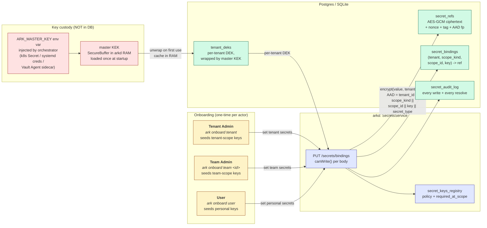
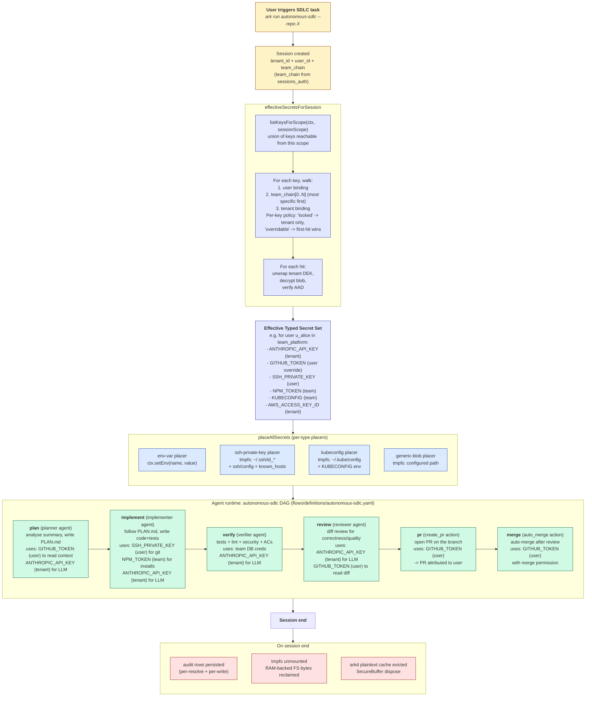
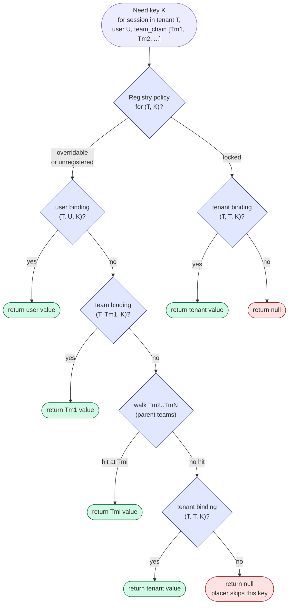
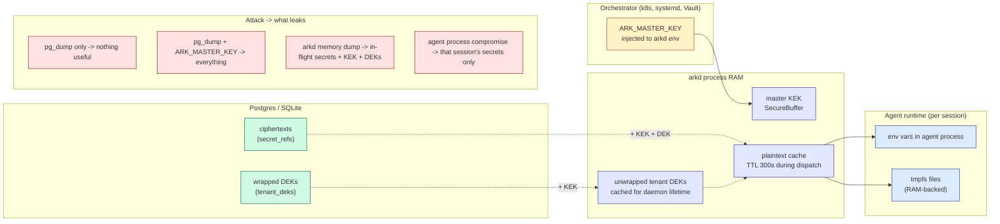

# Hierarchical Secrets -- End-to-End Flow Diagrams

Companion to `2026-05-13-hierarchical-secrets-design.md`. Shows how a development task moves through Ark's autonomous SDLC flow with secrets resolving across tenant / team / user scopes.

---

## 1. Architecture overview

Who writes secrets, where they land, and how key custody splits from the encrypted data store.



**Key property:** the master KEK lives outside the data store. A leaked `pg_dump` alone is useless -- the attacker has ciphertexts and wrapped DEKs but no way to unwrap them without the env var.

---

## 2. Session dispatch + SDLC execution

What happens when a user triggers an `autonomous-sdlc` flow. The effective secret set is computed once at dispatch and feeds the placer pipeline. The agent then runs through SDLC stages with each stage consuming the secrets it needs.



**Stage names match `flows/definitions/autonomous-sdlc.yaml`** (plan -> implement -> verify -> review -> pr -> merge). Per-stage secret use is illustrative: what each stage touches is determined by the agent definition + runtime YAML, not by a hardcoded mapping. The resolver hands the agent the full effective set; the agent uses whichever vars it needs at each stage.

---

## 3. Resolution algorithm (per key)

Decision tree the resolver walks for each registered key when computing the effective set. Applied independently for every key the agent might need.



**Locked vs overridable rationale:**
- `locked` is for compliance-sensitive keys where the tenant must dictate the value (e.g., the tenant's official Anthropic billing key when finance requires it).
- `overridable` is the default: most-specific scope wins, with sensible fallbacks. Lets a user's personal `GITHUB_TOKEN` shadow the team's bot token so commits attribute correctly.

---

## 4. Trust boundaries at a glance

Where each piece of material lives and what would have to be compromised to leak plaintext.



**Read this as a defense-in-depth statement:** an attacker needs two of {DB access, orchestrator-managed env, arkd process memory, agent runtime} to escalate. Single-layer compromises are contained.

---

## 5. Concrete walkthrough -- a real session

Alice is a user in tenant `acme`, member of teams `[platform, eng]`. She triggers `ark run autonomous-sdlc --repo github.com/acme/api --issue 142`.

**Registry state (set during onboarding):**
| Key | Policy | Required at |
|---|---|---|
| `ANTHROPIC_API_KEY` | overridable | tenant |
| `GITHUB_TOKEN` | overridable | user |
| `SSH_PRIVATE_KEY` | overridable | user |
| `NPM_TOKEN` | overridable | team |
| `KUBECONFIG` | overridable | team |
| `AWS_ACCESS_KEY_ID` | locked | tenant |
| `AWS_SECRET_ACCESS_KEY` | locked | tenant |

**Bindings in the DB:**

| Scope | Key | Set by |
|---|---|---|
| tenant=acme | ANTHROPIC_API_KEY | tenant admin |
| tenant=acme | AWS_ACCESS_KEY_ID | tenant admin |
| tenant=acme | AWS_SECRET_ACCESS_KEY | tenant admin |
| team=platform | NPM_TOKEN | platform team admin |
| team=platform | KUBECONFIG | platform team admin |
| team=eng | GITHUB_TOKEN | eng team admin (org bot PAT) |
| user=alice | GITHUB_TOKEN | alice (personal PAT) |
| user=alice | SSH_PRIVATE_KEY | alice |

**Resolver output for Alice's session:**

| Key | Resolved to | Why |
|---|---|---|
| ANTHROPIC_API_KEY | tenant value | no user/team override |
| AWS_ACCESS_KEY_ID | tenant value | locked policy -> tenant only |
| AWS_SECRET_ACCESS_KEY | tenant value | locked policy -> tenant only |
| GITHUB_TOKEN | **alice's personal PAT** | user binding shadows team bot |
| SSH_PRIVATE_KEY | alice's key | only user binding exists |
| NPM_TOKEN | platform team value | most-specific team in chain |
| KUBECONFIG | platform team value | most-specific team in chain |

**Audit emits during this session:**
- 1x `kind=system, action=resolve` per key (7 rows) on dispatch.
- 1x audit row at session end summarizing source mix.
- 0x writes -- this session only reads.

**Commit attribution:** PR opened in stage `pr` (and auto-merged in stage `merge`) carries Alice's identity because the user-scope `GITHUB_TOKEN` shadowed the team bot. Audit trail proves the agent used Alice's credentials, not the bot.

---

## Notes on rendering

These diagrams are Mermaid. They render natively in:
- GitHub (web + mobile)
- VS Code with the Mermaid preview extension
- Most modern markdown viewers (Obsidian, Notion, etc.)

For a hand-drawn / sketchy look closer to Excalidraw, the Mermaid theme can be set to `handDrawn` via a directive:

```text
%%{init: {'theme':'base', 'themeVariables': {'primaryColor':'#fff'}, 'flowchart': {'curve':'basis'}}}%%
```

If a true Excalidraw `.excalidraw` JSON is preferred (for direct editing on excalidraw.com), these can be hand-converted -- ping for that round-trip.
