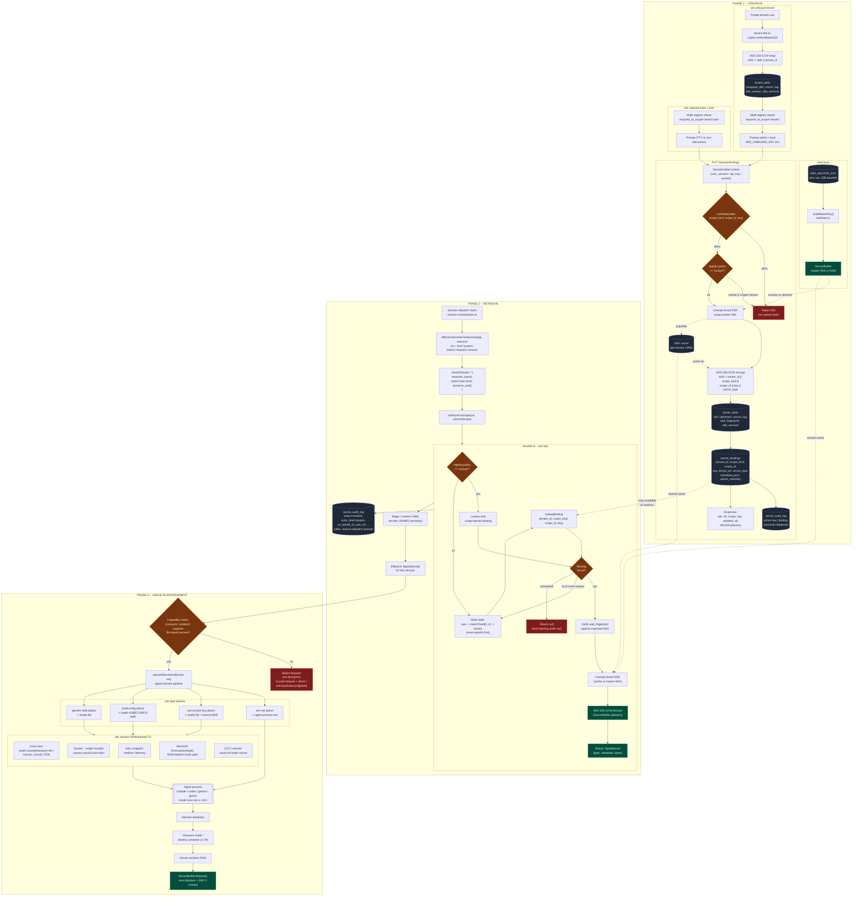

# Hierarchical Secrets -- Lifecycle Diagram

Live mermaid view of the secrets manager component covering **creation**, **retrieval**, and **usage** within an Ark session environment. Backed by:

- `docs/superpowers/specs/2026-05-13-hierarchical-secrets-design.md`
- `docs/superpowers/specs/2026-05-13-hierarchical-secrets-flow.md`

---

## End-to-end lifecycle (flowchart)



---

## Dispatch-time sequence (zoomed in)

```mermaid
sequenceDiagram
    autonumber
    participant Op as Operator
    participant Env as ARK_MASTER_KEY
    participant Arkd as arkd
    participant DB as SQLite/Postgres
    participant DEK as tenant DEK cache
    participant Disp as Dispatcher
    participant Plc as Placer
    participant TMP as tmpfs /run/ark/session/&lt;id&gt;/
    participant Agt as Agent process

    Op->>Env: export ARK_MASTER_KEY=$(openssl rand -base64 32)
    Op->>Arkd: start arkd
    Arkd->>Env: read once at startup
    Arkd->>Arkd: SecureBuffer(master KEK)

    Note over Disp,DB: session.start (user U, tenant T, teamChain [Ta, Tb])

    Disp->>Arkd: effectiveSecretsForSession(session)
    Arkd->>DB: SELECT team_chain FROM sessions_auth
    Arkd->>DB: SELECT keys FROM secret_keys_registry WHERE tenant_id=T

    loop per registered key K
        Arkd->>DB: SELECT policy FROM secret_keys_registry
        alt policy = locked
            Arkd->>DB: lookupBinding(T, 'tenant', T, K)
        else policy = overridable
            Arkd->>DB: lookupBinding(T, 'user', U, K)
            opt no user binding
                Arkd->>DB: lookupBinding(T, 'team', Ta, K)
            end
            opt no team binding
                Arkd->>DB: lookupBinding(T, 'team', Tb, K)
            end
            opt no team binding
                Arkd->>DB: lookupBinding(T, 'tenant', T, K)
            end
        end
        DB-->>Arkd: secret_bindings + secret_blobs row
        Arkd->>Arkd: verify aad_fingerprint
        alt DEK cached
            DEK-->>Arkd: tenant DEK (SecureBuffer)
        else cache miss
            Arkd->>DB: SELECT wrapped_dek FROM tenant_deks
            Arkd->>Arkd: AES-GCM unwrap with master KEK<br/>AAD = 'dek' || tenant_id
            Arkd->>DEK: cache tenant DEK
        end
        Arkd->>Arkd: AES-GCM decrypt blob<br/>AAD = T||scope_kind||scope_id||K||secret_type
        Arkd->>DB: INSERT secret_audit_log<br/>action=resolve, outcome=ok
    end

    Arkd-->>Disp: TypedSecret[] (effective set)

    Disp->>Disp: capability matrix check<br/>(compute, isolation)

    alt LocalCompute + direct AND file-based secret present
        Disp-->>Disp: reject dispatch, emit named error
    else combo supports RAM-backed FS
        Disp->>Plc: placeAllSecrets(effective set, ctx)
        loop per TypedSecret
            alt secret_type = env-var
                Plc->>Agt: inject into process env
            else file-based (ssh-private-key / kubeconfig / generic-blob)
                Plc->>TMP: write file (0600, owner=agent UID)
                Plc->>Agt: pass path (e.g. SSH_PRIVATE_KEY_FILE, KUBECONFIG)
            end
        end
        Plc->>Plc: SecureBuffer.dispose() plaintext after placement
    end

    Agt->>Agt: agent runs (claude/codex/gemini/goose)

    Note over Agt,TMP: session ends

    Disp->>TMP: unmount tmpfs / destroy container / destroy VM
    TMP-->>Arkd: RAM reclaimed by kernel
    Note over DEK: DEK stays cached for daemon lifetime;<br/>invalidated only on rotation
```

---

## Legend

| Region | Maps to |
|---|---|
| `ARK_MASTER_KEY` env | `EnvKekBackend`, `packages/secrets/kek/load.ts` |
| `tenant_deks` / DEK cache | `packages/secrets/tenant-dek.ts` |
| Wrap / unwrap / cipher | `packages/secrets/cipher.ts` (AES-256-GCM + AAD) |
| `canWrite()` | `packages/secrets/service.ts` |
| Walk `user -> teamChain -> tenant` | `packages/secrets/resolver.ts` |
| `placeAllSecrets` | Typed-secrets pipeline (unchanged) |
| Capability matrix | `packages/secrets/placement-isolation.ts` |
| Audit rows | `packages/secrets/audit.ts` -> `secret_audit_log` |

Three invariants the diagram makes load-bearing:

1. **Master KEK never persists** -- only lives in `ARK_MASTER_KEY` and `SecureBuffer`. DB dump alone yields no plaintext.
2. **AAD binds scope + type** -- swapping a ciphertext into a different scope or secret_type fails GCM verification.
3. **Plaintext never leaves dispatch RAM** -- file-based placers go to per-session tmpfs only; `LocalCompute + direct` is env-var-only and rejected pre-decryption otherwise.
