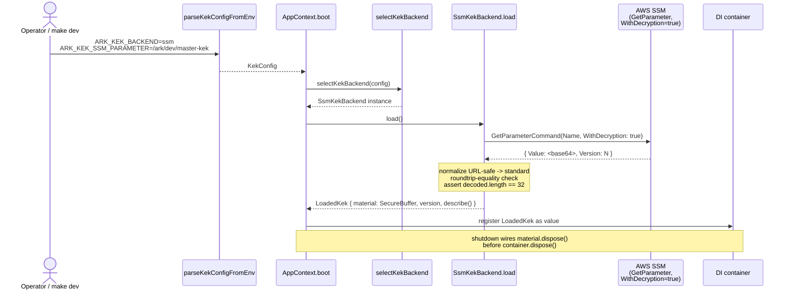
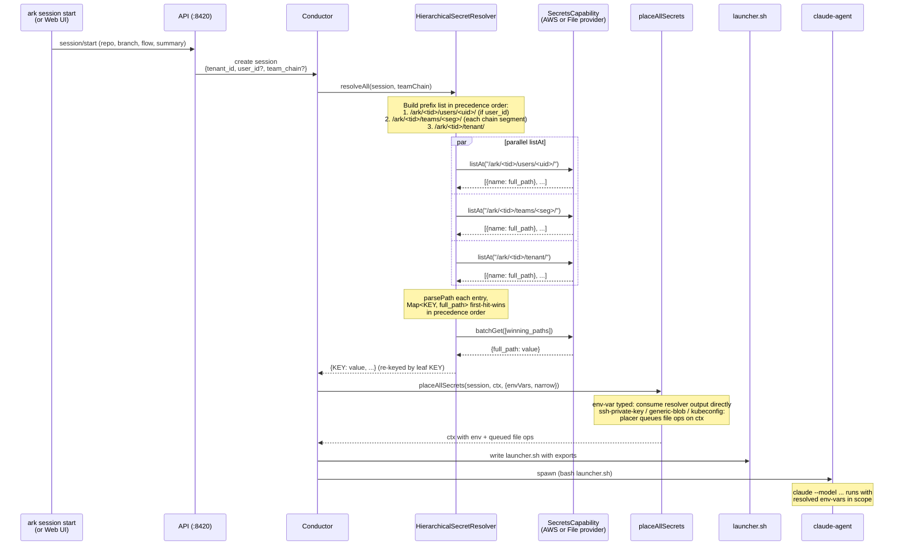
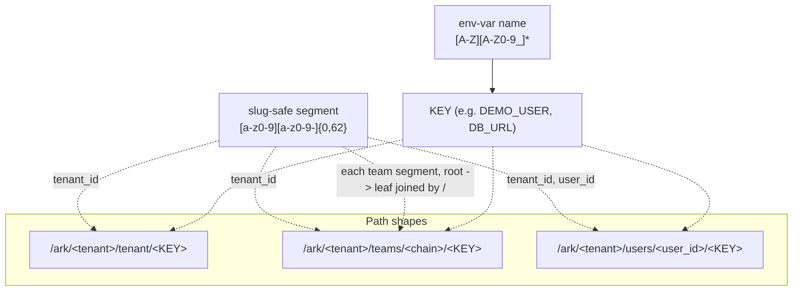
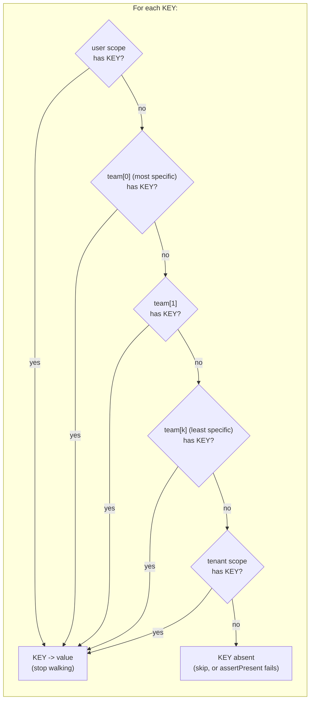

# Hierarchical Secrets -- Shipped Architecture + Runtime Flow

> PR companion doc. Covers **what was shipped** across Phase 1 + Phase 2 + the placement-resolver fix on `feature/ssm-kek-backend`, **how secrets flow at runtime**, and where the design ended up vs the original spec.

## TL;DR

- Master key loads from AWS SSM at boot. Per-tenant DEKs, AES-GCM cipher, and a new `secret_bindings` DB table were **rejected as unnecessary** -- we route to the backend instead of re-implementing what it already does.
- Storage key is the path itself: `/ark/<tenant>/{tenant|teams/<chain>|users/<uid>}/<KEY>`. The convention IS the binding.
- Dispatch walks `user -> team chain (most-specific first) -> tenant`, first hit per KEY wins, places the effective set into the agent's env. No more YAML `secrets:` allowlists.
- Backend abstraction (`SecretsCapability`) keeps `FileSecretsProvider` for local dev + `AwsSecretsProvider` for prod. Vault is one impl away.

## What shipped (commit-by-commit on `feature/ssm-kek-backend`)

| Layer | Commits | What it delivers |
|---|---|---|
| Phase 1 -- KEK seam | `KekBackend interface` + `SsmKekBackend` + `loadMasterKey` + `AppContext.boot` wiring + `SecureBuffer` zero-on-dispose + arkd boot smoke test | Master KEK loaded from SSM at boot; arkd fails fast on misconfig; never leaks key bytes in errors. |
| Phase 1 follow-up | `fix(secrets): accept URL-safe base64 in SsmKekBackend` | Operators rotating with `openssl rand -base64 32 \| tr '+/' '-_'` don't get a spurious validation reject. |
| Phase 2 -- Resolver | `path-convention helpers` + `SecretsCapability.{listAt,batchGet}` + AWS + File provider impls + `HierarchicalSecretResolver` + LocalStack integration test + `refactor(dispatch): HierarchicalSecretResolver; stage YAML is assert-only` + `chore(runtimes): drop superseded YAML secrets: allowlist` + `feat(cli): scope flags on secrets set/list/get/delete/describe` + operator usage doc | The router. Path convention is the binding. CLI gets `--scope <tenant|team|user> --scope-id <id>` flags. Runtime YAML `secrets:` field retired. |
| Fix follow-up | `feat: placeAllSecrets accepts pre-resolved envVars` + `fix: placeAllSecrets reads env-var secrets from resolver, not flat tenant table` + `refactor(dispatch): single env-var source -- placeAllSecrets via resolver` + `test: in-process end-to-end smoke for hierarchical resolver -> placement` | Closes the D2 supersession gap the Phase 2 implementer missed: placeAllSecrets now consumes resolver output, the legacy iterator no longer wins the merge, path-shaped storage keys can't leak into env-var name validation. |

**Test count:** 185 passing across `packages/secrets/`, `packages/core/secrets/`, `packages/core/services/dispatch/`. 0 failures.

## Component view

```mermaid
flowchart LR
    subgraph BOOT["AppContext.boot()"]
        ENV["ARK_KEK_BACKEND=ssm<br/>ARK_KEK_SSM_PARAMETER=..."]
        LMK["loadMasterKey(config)"]
        KEK["SsmKekBackend"]
        SB["SecureBuffer<br/>(32-byte, zero-on-dispose)"]
        DI["DI container<br/>(LoadedKek registered)"]
        ENV --> LMK --> KEK --> SB --> DI
    end

    subgraph DISPATCH["Session dispatch"]
        SESS["Session<br/>(tenant_id, user_id?,<br/>team_chain?)"]
        RESV["HierarchicalSecretResolver"]
        CAP["SecretsCapability<br/>(AwsSecretsProvider<br/>or FileSecretsProvider)"]
        PLACE["placeAllSecrets<br/>(consumes resolver output)"]
        ENVF["Effective env<br/>{KEY: value, ...}"]
        LAUNCH["launcher.sh<br/>(exports + claude exec)"]
        SESS --> RESV
        RESV -->|listAt prefix| CAP
        CAP -->|"{name: full_path}[]"| RESV
        RESV -->|batchGet winners| CAP
        CAP -->|"{path: value}"| RESV
        RESV -->|"{KEY: value}"| PLACE
        PLACE -->|env-var typed| ENVF
        ENVF --> LAUNCH
    end

    DI -.future use<br/>(file backend at-rest).-> CAP
```



`LoadedKek` from boot is registered in the container. Today the resolver doesn't read it -- the backend handles encryption-at-rest. The KEK becomes load-bearing again only if a future `file` backend wants Ark-side at-rest crypto. That keeps the seam intact without making it critical-path now.

## Boot flow (Phase 1)



Fail-fast properties:
- Missing `ARK_KEK_BACKEND` -> `Error: AppContext.boot: config.kek is missing` at startup
- SSM lookup fails -> `KekLoadError` with the parameter name + AWS error code, **no bytes of partial material**
- Decoded length != 32 -> error message has length, decoded buffer zeroed immediately
- `SecureBuffer.dispose()` zero-fills before release

Local-dev escape hatch: `ARK_KEK_TEST_STUB=1` skips the SSM call entirely and loads a deterministic 32-byte stub. Used by `make dev` so contributors don't need an AWS account.

## Dispatch flow (Phase 2 + fix) -- the load-bearing path



What changed between Phase 2 and the fix:

- **Phase 2 wired** `HierarchicalSecretResolver` into `StageSecretResolver`. Its output landed in `secretEnv.env`.
- **`placeAllSecrets` was still iterating the flat tenant secrets table** in parallel; `Object.assign(env, ctx.getEnv())` made placement win the merge.
- **The fix** makes `placeAllSecrets` accept the resolver's pre-resolved env-var map as its source. Path-shaped storage keys never reach env-var name validation. Override semantics work.

## Path convention -- the binding



Validation enforced at the path-helpers layer (`packages/secrets/resolver/paths.ts`):
- Slugs reject `..`, `/`, leading dot
- KEY rejects anything that isn't uppercase ASCII / digits / underscore
- Constructed paths are bounded well under SSM's 2048-char param-name limit even at 5-level team depth

## Precedence at resolution time



The resolver does this lookup per KEY independently. The full effective set is the union of "first hit per KEY" across every KEY that exists at any scope visible to this `(tenant, team_chain, user)` triple.

## What was retired (and how to spot it in the diff)

| Retired | Replaced by |
|---|---|
| `secrets: [NAMES]` field in `runtimes/*.yaml` | Removed entirely. Resolver enumerates from the backend per scope. |
| `secrets: [NAMES]` field in stage YAML | Kept as **assert-present only** (fail dispatch if a required key didn't resolve). No longer a filter on what to resolve. |
| `placeAllSecrets` iterating the flat tenant secrets table for env-vars | Now accepts pre-resolved `envVars` map from `HierarchicalSecretResolver`. |
| Original spec's `secret_bindings` DB table | Dropped. Path convention IS the binding. No new schema. |
| Original spec's per-tenant DEK + cipher | Dropped. Backend (SSM/Vault) handles at-rest. |

## What was preserved

- `SecretsCapability` provider abstraction (`AwsSecretsProvider`, `FileSecretsProvider`) -- unchanged interface plus two new methods (`listAt`, `batchGet`)
- Typed-secret placers for `ssh-private-key`, `generic-blob`, `kubeconfig` -- their names are validated env-var-shape on write, so they keep reading flat-tenant storage. Migration to scope-aware storage is a separate plan.
- Phase 1 KEK code (`packages/secrets/kek/*`) -- stays as the SSM-mechanics proving ground. Becomes load-bearing again only if a `file` backend with Ark-side at-rest crypto lands.
- Existing identity tables (`tenants`, `teams.parent_team_id`, `memberships`, `sessions_auth.team_chain`) -- the scope structure was already there.

## Local dev setup (operator quick-reference)

```bash
# Daemon: clean PATH avoids unexpanded-$PATH posix_spawn bug.
# ARK_KEK_TEST_STUB=1 skips real SSM at boot.
# ARK_DEV_FORCE_DIRECT=1 routes Anthropic calls through ~/.claude/credentials.json.
env -i HOME="$HOME" USER="$USER" SHELL="$SHELL" TERM="$TERM" \
  PATH="$HOME/.bun/bin:$HOME/.ark/bin:$HOME/.local/bin:/opt/homebrew/bin:/opt/homebrew/sbin:/usr/local/bin:/usr/bin:/bin:/usr/sbin:/sbin" \
  ARK_DEV_FORCE_DIRECT=1 ARK_KEK_TEST_STUB=1 \
  ./ark server daemon start --detach

# Foreground API + Vite
env -i HOME="$HOME" USER="$USER" SHELL="$SHELL" TERM="$TERM" \
  PATH="$HOME/.bun/bin:$HOME/.ark/bin:$HOME/.local/bin:/opt/homebrew/bin:/opt/homebrew/sbin:/usr/local/bin:/usr/bin:/bin:/usr/sbin:/sbin" \
  ARK_DEV_FORCE_DIRECT=1 ARK_KEK_TEST_STUB=1 \
  make dev
```

CLI scope flags:
```bash
ark secrets set DB_URL --scope tenant                           # tenant default
ark secrets set DB_URL --scope team --scope-id eng/payments     # team override
ark secrets set DB_URL --scope user --scope-id alice            # user override
ark secrets list --scope user --scope-id alice
ark secrets delete DB_URL --scope team --scope-id eng/payments -y
```

A session dispatched from the authenticated Web UI inherits the logged-in user's `user_id` + `team_chain`; the resolver walks all three scopes. CLI-dispatched sessions are unauthenticated (`user_id = null`) and only walk tenant scope -- expected.

## Known follow-ups (not in this PR)

- `ark session start --user-id <id>` flag (or `ARK_DEV_USER_ID` env) so CLI dispatches can forge a user identity for local override demos. ~10 LoC.
- Audit log table + write-path instrumentation. Backend-side audit (CloudTrail / SSM history) covers most of this; an Ark-side audit is a separate plan.
- Per-key policy ("locked at tenant" vetoes user-scope writes). Currently scope precedence is the only policy.
- HTTP/REST surface for secrets management (Web UI today drives via JSON-RPC).
- Vault backend implementation (slots into `SecretsCapability` -- one provider class).
- One-time migration of legacy flat `secrets` table rows to path-conventioned writes under `/ark/<tid>/tenant/<KEY>`. Today the File provider does this lazily on read; an explicit migration script would let operators clean up.
- Migration of non-env-var typed secrets (`ssh-private-key`, `generic-blob`, `kubeconfig`) to scope-aware storage. Separate plan; touches placer signatures.
